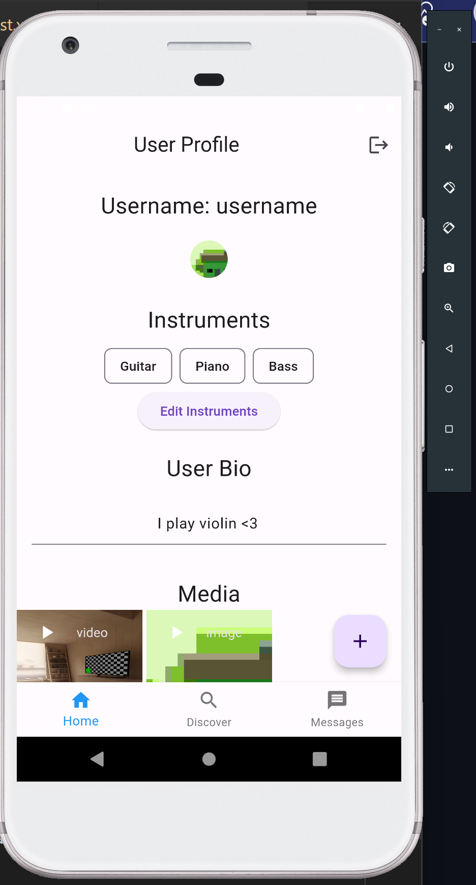

# Music Networking Application - Senior Project Portfolio

## Project Overview
This project aims to connect musicians globally, allowing them to collaborate, share, and create music together through 
a user-friendly digital platform. Inspired by the connectivity of social networking, this application bridges the 
gap in the musical landscape by leveraging modern web technologies.

## Features
- Real-time collaboration tools
- Music sharing and management
- User profile customization

For more details on the design and implementation, please refer to the [Design](design.md) and [Implementation](implementation.md) pages.

## Quick Links
- [Design Diagrams](design.md)
- [Code Snippets](code.md)
- [Implementation Details](implementation.md)
- [Running the Project](setup.md)
- [About the Project](about.md)
