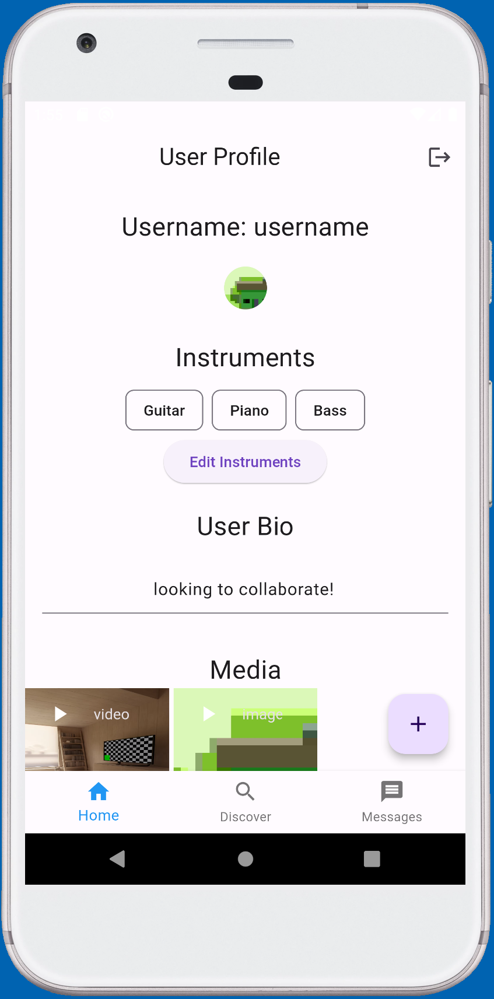

# Music Networking Application - Senior Project Portfolio

## Project Overview
The project at hand involves the development of a music networking application that emulates the user interface and functionality of a dating app. In this unique endeavor, the goal was to create a digital platform where musicians could connect, discover, and collaborate with fellow artists, fostering creative partnerships within a dynamic and user-friendly environment. Inspired by the dating app style, the project aims to provide musicians with a novel means of finding like-minded individuals, sharing their musical talents, and growing within a supportive musical community.

The project effectively delivers a user-friendly and aesthetically pleasing music networking app that replicates the interface of popular dating apps. Users are able to create profiles, explore potential music matches, engage in conversations, and initiate collaborations, all while enjoying a seamless and intuitive user experience. This innovative application opens new avenues for musicians to connect, share their artistic endeavors, and build meaningful musical partnerships, contributing to the broader context of the ever-evolving music industry and the digital transformation of artistic collaboration.

## Features
- Real-time collaboration tools
- Music sharing and management
- User profile customization

For more details on the design and implementation, please refer to the [Design](design.md) and [Implementation](implementation.md) pages.

## Quick Links
- [Design Diagrams](design.md)
- [Code Snippets](code.md)
- [Implementation Details](implementation.md)
- [Running the Project](setup.md)
- [About the Project](about.md)
