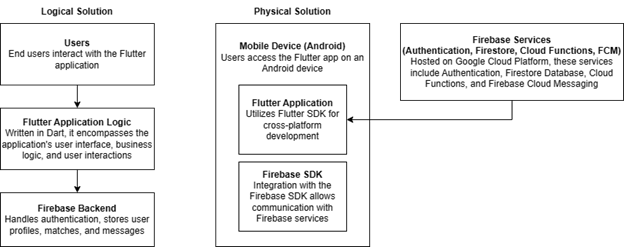
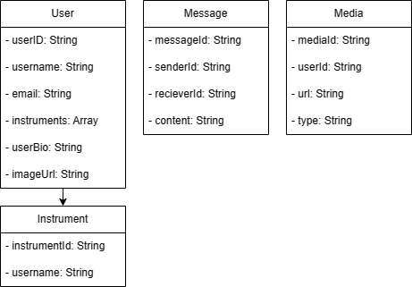

# Design Introduction
The musician networking application is a user-friendly platform designed for musicians of all levels to connect, collaborate, and create together. It creates a space where musicians can effortlessly find like-minded individuals who share similar musical interests, whether they play instruments like guitar or piano or have a passion for specific genres like rock or blues. Through an intuitive interface, users can create personalized profiles showcasing their musical background, instruments they play, and a brief bio. The app employs a smart matching system that suggests potential musical collaborators based on shared interests, opening up exciting possibilities for joint projects and creative endeavors.

## Detailed High-Level Solution Design
To bring the musician networking application to life, several critical solution configuration changes and considerations have been outlined. First and foremost, Firebase configuration plays a pivotal role in establishing a secure and efficient backend. This involves configuring Firebase to seamlessly integrate Authentication, Firestore, Cloud Functions, and Firebase Cloud Messaging (FCM). To ensure data security and controlled access, robust security rules will be established within Firebase. Simultaneously, the Flutter app's configuration is key to its seamless interaction with Firebase. By configuring the Flutter app to use the Firebase SDK for Dart and setting up essential dependencies within the Flutter project, a cohesive integration with Firebase services is achieved.

In addressing non-functional requirements, the application prioritizes security, performance, and reliability. Security measures include the implementation of Firebase Authentication for user registration and login, backed by Firebase's built-in features for data encryption at rest and in transit. Performance considerations involve dynamic scaling in Firestore based on demand, ensuring optimal database performance. The Flutter app further enhances performance through the incorporation of data caching mechanisms, enhancing the overall user experience. For reliability and scalability of server-side logic, Firebase Cloud Functions are employed, ensuring seamless execution and scalability of backend processes.

The detailed solution architecture serves as a comprehensive guide for developers, offering insights into the logical and physical design of the application. This includes specifics on configuration changes, security measures, performance optimizations, and the reliable execution of serverless logic. Developers can refer to this architecture throughout the development process, providing a solid foundation for the efficient implementation of the musician networking application. Below is a generalized look at the logical and physical design of the application.



## Key Technical Design Decisions
In the technical design decisions for the proposed musician networking application, key frameworks and technologies have been carefully selected to ensure the development of a robust and efficient system. Flutter, chosen as the front-end framework, offers a single codebase for both iOS and Android platforms, facilitating cross-platform development with its hot-reload feature and extensive widget library for a visually appealing user interface. The Dart programming language is adopted for Flutter app development due to its official integration, strong typing, modern features, and ease of learning. I was able to familiarize myself with the platform and the Dart programming language through my first Proof of Concept, which was a note application that allowed users to create, read, update, and delete notes. The Firebase suite serves as the backbone for the application's backend, encompassing Authentication, Firestore/Realtime Database, Cloud Functions, and Firebase Cloud Messaging (FCM). Firebase's serverless architecture and real-time capabilities align seamlessly with Flutter, providing a comprehensive solution for user authentication, data storage, server-side logic, and real-time communication Additionally, Google Cloud Platform (GCP) hosts Firebase services, ensuring a secure and scalable cloud environment to support the backend infrastructure. The utilization of Firebase Authentication further enhances the security of the application's user registration and login processes. I was able to familiarize myself with these services through my second and third proof of concepts, which were a real-time messaging application and a mock dating application. These strategic technology decisions collectively form the foundation for an efficient, scalable, and user-friendly musician networking application.

## Database ER Diagram


The `User` class represents user-related data, including attributes like `userId`, `username`, `email`, `instruments`, `bio`, and `imageUrl`. The `Message` class represents message-related data, including attributes like `messageId`, `senderId`, `receiverId`, and `content`. The `Media` class represents media-related data, including attributes like `mediaId`, `userId`, `url`, and `type`. The `Instrument` class represents musical instruments, with attributes `instrumentId` and `name`. The `Genre` class represents musical genres, with attributes `genreId` and `name`. These classes reflect the relationships between users, messages, media, and instruments within the Firebase NoSQL database. 

## Database Data Definition Language (DDL) Scripts
Since Firebase is a NoSQL database, it doesn't use traditional DDL scripts as you would find in a relational database. Firebase uses a JSON-like structure to store data. The `users`, `messages`, `media`, and `instruments` classes are top-level collections in the Firebase database. Each user has a unique identifier (`userId`) that serves as the key within the `users` collection. Similar key-based structures are used for other collections. The structure of this type of database is flexible and evolves as data is added to it. Below is an example of how the Firebase database will be structured.

```json
{
  "users": {
    "userId1": {
      "username": "JohnDoe",
      "email": "john.doe@example.com",
      "instruments": ["Guitar", "Piano"],
      "bio": "Music enthusiast",
      "imageUrl": "https://example.com/johndoe.jpg"
    },
    "userId2": {
      "username": "JaneSmith",
      "email": "jane.smith@example.com",
      "instruments": ["Violin", "Cello"],
      "bio": "Passionate about music",
      "imageUrl": "https://example.com/janesmith.jpg"
    },
    // ... other user entries
  },
  "messages": {
    "messageId1": {
      "senderId": "userId1",
      "receiverId": "userId2",
      "content": "Hey, let's jam sometime!"
    },
    // ... other message entries
  },
  "media": {
    "mediaId1": {
      "userId": "userId1",
      "url": "https://example.com/music.mp3",
      "type": "audio",
    },
    // ... other media entries
  },
  "instruments": {
    "instrumentId1": {
      "name": "Guitar"
    },
    "instrumentId2": {
      "name": "Piano"
    },
    // ... other instrument entries
  }
}
